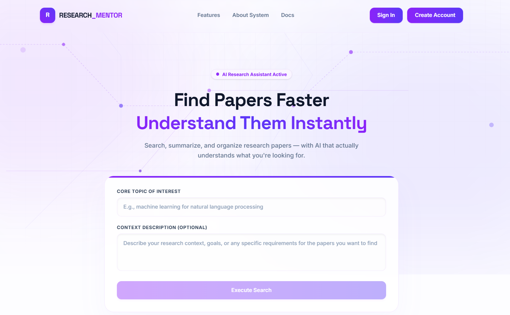
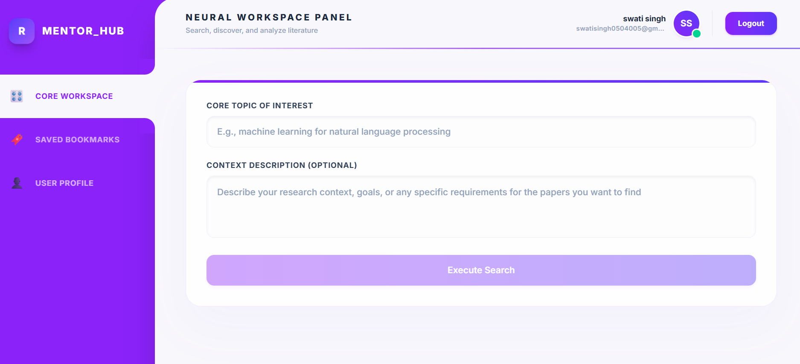
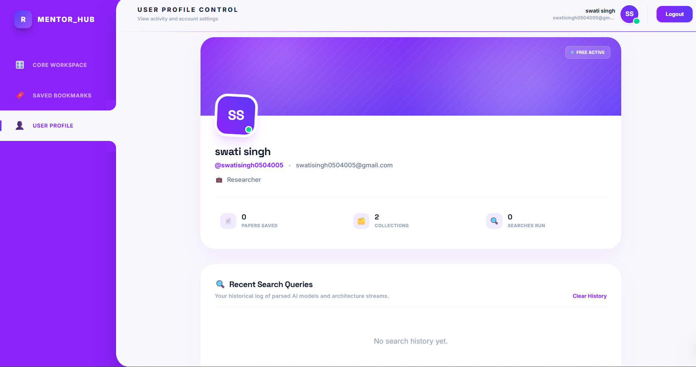
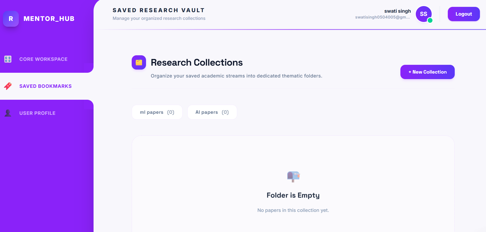

<div align="center">

&nbsp;


# Research Mentor AI

<h3><em>Semantic search meets AI summarization for academic research</em></h3>

<p>
<sub>📄 PAPERS IN → 🧠 EMBEDDINGS → 🔍 SEMANTIC MATCH → ✨ AI SUMMARY → 🎯 RECOMMENDATIONS</sub>
</p>

<table>
<tr>
<td align="center"><b>Backend</b><br/><sub>FastAPI</sub></td>
<td align="center"><b>Frontend</b><br/><sub>React</sub></td>
<td align="center"><b>Vector Store</b><br/><sub>ChromaDB</sub></td>
<td align="center"><b>LLM Engine</b><br/><sub>Gemini</sub></td>
<td align="center"><b>Auth</b><br/><sub>Supabase</sub></td>
</tr>
</table>

`active` · `MIT-style · open for learning` · `PRs welcome`

<p>
<a href="#-features">Features</a> &nbsp;|&nbsp;
<a href="#️-system-architecture">Architecture</a> &nbsp;|&nbsp;
<a href="#️-tech-stack">Tech Stack</a> &nbsp;|&nbsp;
<a href="#️-installation">Installation</a> &nbsp;|&nbsp;
<a href="#-screenshots">Screenshots</a>
</p>

</div>

---

---

## 💡 About

Instead of relying only on keyword matching, **Research Mentor AI** uses **vector embeddings and semantic similarity** to retrieve the most relevant research papers, then presents **AI-generated summaries** to dramatically speed up literature review — turning hours of paper-hunting into minutes.

---

## 🚀 Features

<table>
<tr>
<td width="50%" valign="top">

### 🔍 Semantic Paper Search
- Search using natural language, not just keywords
- Semantic similarity via Sentence Transformers
- Pulls from Semantic Scholar, with arXiv as fallback

</td>
<td width="50%" valign="top">

### 🤖 AI Paper Analysis
- AI-generated summaries powered by **Gemini**
- Automatic keyword extraction
- Difficulty classification:
  - 🟢 Beginner
  - 🟡 Intermediate
  - 🔴 Advanced

</td>
</tr>
<tr>
<td width="50%" valign="top">

### 🧠 Vector Search Engine
- **ChromaDB** vector database for semantic retrieval
- Embedding-based cache system
- Intelligent cache hit / cache miss routing

</td>
<td width="50%" valign="top">

### 📚 Paper Detail Console
- Original abstract + AI summary side by side
- Extracted keywords & difficulty level
- Publication info and direct paper link

</td>
</tr>
<tr>
<td width="50%" valign="top">

### 🎯 AI Recommendations
- Similar-paper recommendations via embedding similarity
- Context-aware recommendation engine
- Fast retrieval from local vector database

</td>
<td width="50%" valign="top">

### ⭐ User Features
- Secure authentication with **Supabase**
- Bookmark papers for later
- Responsive dashboard with modern **Tailwind CSS** UI

</td>
</tr>
</table>

---

## 🏗️ System Architecture

```
                         User Query
                             │
                             ▼
                Gemini Intent Extraction
                             │
                             ▼
                ChromaDB Semantic Search
                             │
                             ▼
                  Cache Hit? ──YES──► Return Cached Papers
                             │
                            NO
                             │
                             ▼
                  Semantic Scholar API
                             │
                             ▼
                      arXiv Fallback
                             │
                             ▼
                     Gemini Analysis
                             │
                             ▼
                   Generate Embeddings
                             │
                             ▼
                    Store in ChromaDB
                             │
                             ▼
                      Return Results
```

---

## 🛠️ Tech Stack

| Layer | Technologies |
|---|---|
| 🎨 **Frontend** | React.js · Vite · Tailwind CSS · Framer Motion · React Router |
| ⚙️ **Backend** | FastAPI · Python |
| 🧠 **AI / ML** | Google Gemini API · Sentence Transformers · ChromaDB · Semantic Search |
| 🌐 **External APIs** | Semantic Scholar API · arXiv API |
| 🗄️ **Database / Auth** | ChromaDB · Supabase |

---

## 📂 Project Structure

```
frontend/
├── src/
│   ├── components/     # Reusable UI components
│   ├── pages/           # Route-level pages
│   ├── context/         # React context providers
│   ├── layouts/         # Page layouts
│   └── services/        # API service calls

backend/
├── src/
│   ├── backend/          # FastAPI app entrypoint & routes
│   │   ├── main.py
│   │   └── routes.py
│   ├── common/           # Shared config & utilities
│   │   ├── config_loader.py
│   │   └── logger.py
│   ├── ingestion/        # Paper fetching (Semantic Scholar, arXiv)
│   │   └── fetch_paper.py
│   └── ml_pipeline/       # Embeddings, LLM analysis, vector store
│       ├── embedder.py
│       ├── llm_analyzer.py
│       ├── search_papers.py
│       └── vector_store.py
```

---

## ⚙️ Installation

### 1️⃣ Clone the Repository
```bash
git clone https://github.com/yourusername/research-mentor-ai.git
```

### 2️⃣ Backend Setup
```bash
cd backend
python -m venv venv
venv\Scripts\activate        # On Mac/Linux: source venv/bin/activate
pip install -r requirements.txt
uvicorn src.backend.main:app --reload
```

### 3️⃣ Frontend Setup
```bash
cd frontend
npm install
npm run dev
```

---

## 🔑 Environment Variables

Create a `.env` file in the backend directory:

```env
GOOGLE_API_KEY=YOUR_GEMINI_API_KEY
SUPABASE_URL=YOUR_SUPABASE_URL
SUPABASE_KEY=YOUR_SUPABASE_ANON_KEY
```

---

## 📸 Screenshots

<div align="center">

| Landing Page | Workspace |
|:---:|:---:|
|  |  |

| Profile | Bookmarks |
|:---:|:---:|
|  |  |

</div>

---

## 🎯 Roadmap

- [ ] 📄 PDF upload & summarization
- [ ] 🔗 Citation generation
- [ ] 🗺️ Research roadmap generation
- [ ] 🗒️ Notes & collections
- [ ] 🔀 Multi-model LLM support
- [ ] 📈 Research trend visualization

---

## 👩‍💻 Author

<div align="center">

**Swati Singh**

Built as an end-to-end AI-powered research assistant integrating semantic search, vector databases, and Large Language Models to simplify academic literature exploration.

[](#)
[](#)

</div>

---

## 📄 License

This project is open for learning and portfolio purposes. Add a license here if you plan to open-source it further.

---

<div align="center">

⭐ If you find this project useful, consider giving it a star!

</div>
